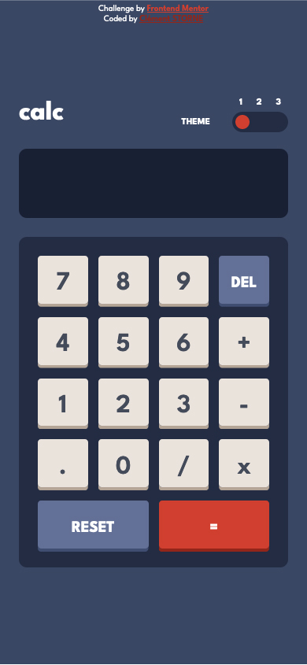
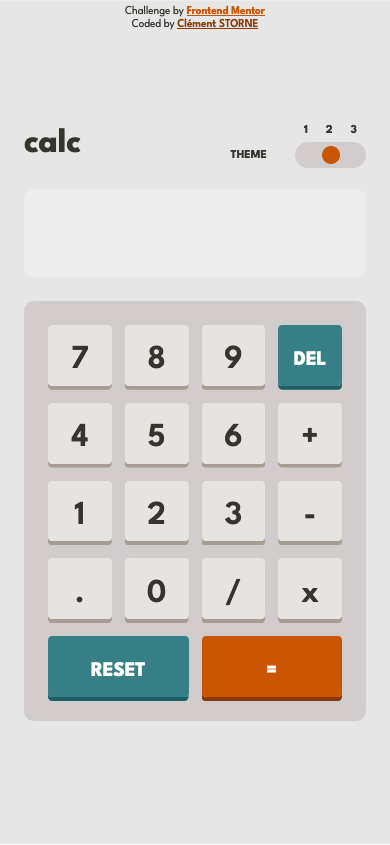
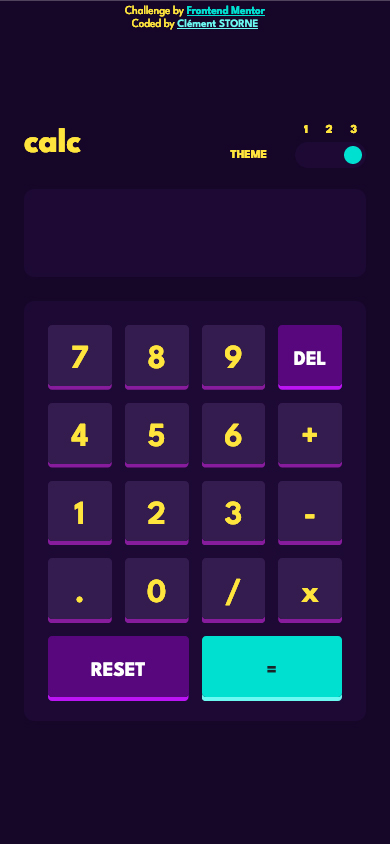

# Frontend Mentor - Calculator app solution

This is a solution to the [Calculator app challenge on Frontend Mentor](https://www.frontendmentor.io/challenges/calculator-app-9lteq5N29). Frontend Mentor challenges help you improve your coding skills by building realistic projects.

## Table of contents

- [Overview](#overview)
  - [Screenshot](#screenshot)
  - [Links](#links)
- [My process](#my-process)
  - [Built with](#built-with)
  - [What I learned](#what-i-learned)
- [Author](#author)

## Overview

### Screenshot





### Links

- Solution URL: [https://github.com/clementstorne/FrontendMentor-calculator-app](https://github.com/clementstorne/FrontendMentor-calculator-app)
- Live Site URL: [https://clementstorne.github.io/FrontendMentor-calculator-app/](https://clementstorne.github.io/FrontendMentor-calculator-app/)

## My process

### Built with

- HTML
- CSS
- Flexbox
- Flexbox
- JavaScript

### What I learned

I learned how to modify CSS variables in a JavaScript script.

```js
document.documentElement.style.setProperty("--background", "hsl(222, 26%, 31%)");
```

## Author

- Github - [Clément Storne](https://github.com/clementstorne)
- Frontend Mentor - [@clementstorne](https://www.frontendmentor.io/profile/clementstorne)
- Twitter - [@clementstorne](https://twitter.com/clementstorne)
